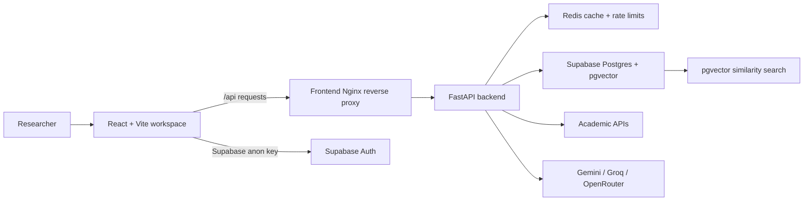

# PolyResearch

PolyResearch is a multilingual research discovery platform that combines academic search, LLM-assisted paper analysis, semantic embeddings, and interactive knowledge graph exploration. It is designed for researchers, students, and review teams who need to move from a broad research question to a structured evidence map.

The system accepts queries in multiple languages, retrieves candidate papers from academic sources, enriches the strongest results with an agentic backend pipeline, stores research metadata in Supabase, and renders the output as an interactive graph in a browser workspace.

## Features

- Multilingual query handling with language detection and translated query variants.
- Academic source aggregation across ArXiv, PubMed, Crossref, EuropePMC, DOAJ, and IEEE.
- LLM-assisted extraction of methodology, findings, limitations, contributions, and research quality.
- Provider fallback across Gemini, Groq, OpenRouter-compatible APIs, and rule-based extraction.
- Sentence Transformer embeddings for semantic relevance and graph construction.
- Supabase Postgres and pgvector persistence for papers, relationships, saved workspaces, and auth.
- Redis-backed semantic caching and public API rate limiting.
- Interactive React Flow graph with filtering, focus mode, graph insights, and paper details.
- Context-grounded research copilot for selected papers and workspace queries.
- Saved papers and collaboration workspace support through Supabase Auth or local guest storage.
- Dockerized frontend, backend, and Redis services for repeatable demos and deployment.

## Architecture Overview



### Request Lifecycle

1. A user submits a research query in the frontend.
2. The frontend sends the request to `POST /api/research/query` with `X-API-Key`.
3. The backend validates API access and rate limits the caller.
4. The pipeline checks Redis for cached semantically similar results.
5. If needed, the backend detects language and creates source-specific query variants.
6. Fetch agents retrieve candidate papers from academic APIs.
7. Validation and ranking agents deduplicate, filter, and score papers.
8. LLM agents enrich selected papers with structured research metadata.
9. Embedding, storage, relationship, and graph agents persist and connect results.
10. The frontend converts the response into an interactive research graph.

## Tech Stack

### Frontend

- React 19
- TypeScript
- Vite
- Tailwind CSS
- React Flow
- Three.js and React Three Fiber
- Framer Motion
- Supabase JavaScript client
- D3 force layout utilities and Graphology

### Backend

- Python 3.11
- FastAPI and Uvicorn
- Pydantic Settings
- Supabase Python client
- Redis asyncio client
- Sentence Transformers
- NetworkX
- aiohttp and httpx
- Gemini, Groq, and OpenRouter-compatible LLM clients

### Infrastructure

- Supabase Postgres with pgvector
- Redis 7
- Docker and Docker Compose
- Nginx for frontend serving and `/api` reverse proxying

## Repository Structure

```text
.
|-- Backend/
|   |-- src/
|   |   |-- agents/          # Agentic pipeline steps
|   |   |-- api/             # FastAPI app, routes, security dependencies
|   |   |-- cache/           # Redis cache and rate-limit helpers
|   |   |-- config/          # Environment settings and validation
|   |   |-- core/            # Embeddings, graph utilities, training collector
|   |   |-- database/        # Supabase data access
|   |   |-- integrations/    # Academic source clients
|   |   `-- pipeline/        # Orchestration and SSE event emission
|   |-- docker/              # Backend Dockerfiles
|   |-- scripts/             # Setup and smoke-test scripts
|   `-- supabase/migrations/ # Schema, pgvector, and RLS migrations
|-- Frontend/
|   |-- src/
|   |   |-- api/             # Backend API client
|   |   |-- components/      # Workspace UI components
|   |   |-- lib/             # Supabase, auth, workspace helpers
|   |   `-- types/           # Shared frontend types
|   `-- public/
|-- docs/
|   |-- REPOSITORY_HARDENING.md
|   |-- REFACTORING_PLAN.md
|   |-- PRODUCTION_READINESS.md
|   `-- screenshots/
|-- docker-compose.yml
|-- .dockerignore
|-- .gitignore
`-- README.md
```

## Installation

### Prerequisites

- Node.js 20 or newer
- npm 10 or newer
- Python 3.11 if running the backend outside Docker
- Docker Desktop
- A Supabase project
- At least one LLM provider key for full-quality paper enrichment

### Supabase Setup

1. Create a Supabase project.
2. Enable the `vector` extension if it is not already enabled.
3. Apply migrations from `Backend/supabase/migrations` in order.
4. Copy the Supabase project URL, anon key, and service role key into backend and frontend environment files.

### Frontend Setup

```bash
cd Frontend
cp .env.example .env
npm install
npm run dev
```

The local frontend runs at:

```text
http://localhost:5173
```

### Backend Setup Without Docker

Docker is recommended because the ML dependencies are large. For a manual backend run:

```bash
cd Backend
cp .env.example .env
python -m venv .venv
source .venv/bin/activate
pip install -r requirements.txt
python -m uvicorn main:app --host 0.0.0.0 --port 8000
```

On Windows PowerShell:

```powershell
cd Backend
Copy-Item .env.example .env
python -m venv .venv
.\.venv\Scripts\Activate.ps1
pip install -r requirements.txt
python -m uvicorn main:app --host 0.0.0.0 --port 8000
```

## Environment Setup

Create these files from templates:

- `Backend/.env`
- `Frontend/.env`
- `.env` at the repository root when using root Docker Compose build args

Required backend variables:

- `SUPABASE_URL`
- `SUPABASE_KEY`
- `SUPABASE_SERVICE_KEY`
- `PUBLIC_API_KEY`
- `ADMIN_API_KEY`

Recommended backend variables:

- `GEMINI_API_KEY`
- `GROQ_API_KEY`
- `OPENROUTER_API_KEY`

Required frontend variables:

- `VITE_SUPABASE_URL`
- `VITE_SUPABASE_ANON_KEY`
- `VITE_PUBLIC_API_KEY`

`VITE_PUBLIC_API_KEY` must match `Backend/.env` `PUBLIC_API_KEY`. This value is browser-visible after build, so it is not a true secret. It reduces accidental public access, while backend rate limits and deployment controls provide the real protection.

Generate backend API keys with a cryptographically strong source:

```bash
openssl rand -hex 32
```

## Docker Setup

### Production-Style Full Stack

Configure `Backend/.env`, `Frontend/.env`, and root `.env`, then run:

```bash
docker compose up --build
```

The root stack starts:

- `frontend`: Nginx-served React build and `/api` reverse proxy.
- `backend`: FastAPI research API.
- `redis`: cache and distributed rate-limit store.

The default frontend port is:

```text
http://localhost:8080
```

### Backend Development Compose

The backend folder also includes a development-oriented compose setup:

```bash
cd Backend
docker build -f docker/Dockerfile.mlbase -t ml-base-cpu:v1 .
docker compose up --build
```

## API Overview

Public API endpoints require `X-API-Key` or `Authorization: Bearer <token>` unless explicitly marked public.

| Method | Endpoint | Purpose |
| --- | --- | --- |
| `GET` | `/api/health` | Public health and database readiness check |
| `POST` | `/api/research/query` | Run the research pipeline and return final graph data |
| `GET` | `/api/research/stream` | Stream research pipeline events with SSE |
| `POST` | `/api/chat` | Ask the research copilot using selected paper context |
| `GET` | `/api/papers/search` | Search stored papers |
| `GET` | `/api/papers/{paper_id}` | Fetch one paper and its relationships |
| `GET` | `/api/stats` | Return database paper and relationship counts |

Admin endpoints require `X-Admin-Token`:

| Method | Endpoint | Purpose |
| --- | --- | --- |
| `POST` | `/api/cleanup` | Manually delete stale papers |
| `GET` | `/api/training-data/stats` | Inspect collected LLM training examples |
| `GET` | `/api/training-data/export` | Export collected training examples |

## Screenshots

Add polished, compressed screenshots under `docs/screenshots/` before publishing:

- `landing-search.png`: landing search experience.
- `research-graph.png`: graph workspace after a successful query.
- `paper-panel.png`: paper detail and evidence panel.
- `copilot.png`: context-grounded research copilot.
- `saved-papers.png`: saved papers workspace.
- `collaboration.png`: team collaboration page.

## Demo Workflow

1. Start the full stack with `docker compose up --build`.
2. Open `http://localhost:8080`.
3. Search for a topic such as `retrieval augmented generation in healthcare`.
4. Wait for the graph to build and inspect the progress UI.
5. Select a paper node to view metadata, findings, methodology, and limitations.
6. Use graph filters to narrow by domain or source.
7. Ask the copilot for a grounded summary, comparison, or research gap analysis.
8. Save key papers and open the collaboration workspace to simulate team review.

## Security Notes

- Never commit `.env` files.
- Keep `SUPABASE_SERVICE_KEY` backend-only.
- Use the Supabase anon key only in browser code.
- Keep `REQUIRE_PUBLIC_API_KEY=true` for deployed environments.
- Keep `ALLOW_QUERY_STRING_API_KEY=false` in production because query strings are commonly logged.
- Restrict `CORS_ALLOWED_ORIGINS` to deployed frontend domains.
- Keep API docs disabled in production unless protected by authentication.
- Rotate keys immediately if they appeared in screenshots, terminal recordings, chat, or Git history.

## Future Improvements

- Add CI for frontend lint, frontend build, backend import checks, Docker builds, and secret scanning.
- Add pytest coverage for auth dependencies, route behavior, graph generation, and pipeline failure modes.
- Add Playwright smoke tests for the demo workflow.
- Move frontend fallback graph edge generation fully into the backend graph service.
- Add OpenAPI response models for every route.
- Add observability with request IDs, metrics, tracing, and structured error dashboards.
- Add deployment recipes for Render/Fly.io/Railway/AWS plus managed Redis.
- Add backup, retention, and migration rollback guidance for Supabase.

## Contributors

This project was developed as a final-year engineering project by a team of four students.

| Name | Responsibility |
| --- | --- |
| Surya Narayanan KG | Full-stack engineering, repository hardening, and delivery coordination |
| Thillainatarajan B | Backend API, pipeline, and data integrations |
| Siva Prakash | ML, embeddings, LLM evaluation, and graph logic |
| Adithiyan C | Frontend UX, Supabase workspace flows, and documentation |

## License

This project is licensed under the MIT License.
