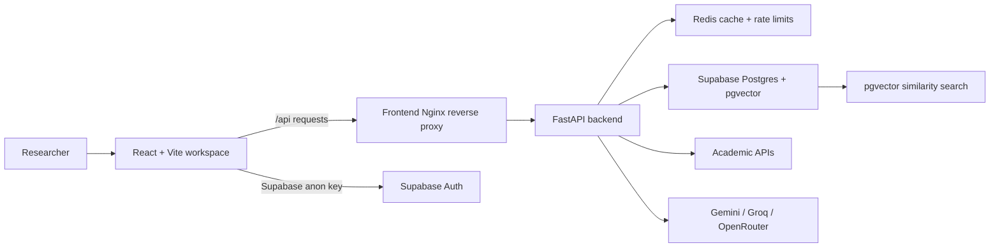

# PolyResearch

PolyResearch is a multilingual research discovery platform built as our final-year engineering project. The main idea behind the project was to make research paper exploration more interactive and easier to understand using semantic search, knowledge graphs, and LLM-assisted analysis.

Instead of showing papers as just a long list of search results, the system tries to connect related papers, highlight important findings, and visualize relationships between research topics in an interactive graph workspace.

The project combines a React frontend, FastAPI backend, Redis caching, Supabase with pgvector, Docker-based deployment, and multiple academic research APIs.

---

# Features

* Search research topics in multiple languages
* Fetch papers from sources like ArXiv, PubMed, Crossref, EuropePMC, DOAJ, and IEEE
* Generate paper summaries and insights using LLMs
* Build semantic relationships between papers using embeddings
* Interactive graph visualization for exploring connected research
* Redis-based caching for repeated searches
* Supabase authentication and saved workspace support
* Research copilot/chat assistant for selected papers
* Dockerized setup for easier local development and deployment

---

## Architecture Overview



### Basic Workflow

1. The user enters a research query in the frontend.
2. The backend processes the query and searches multiple academic APIs.
3. Relevant papers are filtered and analyzed.
4. Embeddings are generated for semantic similarity.
5. Relationships between papers are created.
6. The frontend displays the results as an interactive knowledge graph.

---

# Tech Stack

## Frontend

* React
* TypeScript
* Vite
* Tailwind CSS
* React Flow
* Three.js
* Framer Motion

## Backend

* Python
* FastAPI
* Redis
* Sentence Transformers
* NetworkX
* aiohttp / httpx

## Database & Infrastructure

* Supabase
* PostgreSQL + pgvector
* Docker
* Docker Compose
* Nginx

## LLM Providers

* Gemini
* Groq
* OpenRouter-compatible APIs

---

# Repository Structure

```text
.
├── Backend/
│   ├── src/
│   ├── docker/
│   ├── scripts/
│   └── supabase/
│
├── Frontend/
│   ├── src/
│   └── public/
│
├── docs/
│   ├── screenshots/
│   ├── PRODUCTION_READINESS.md
│   ├── REFACTORING_PLAN.md
│   └── REPOSITORY_HARDENING.md
│
├── docker-compose.yml
├── README.md
├── LICENSE
└── .gitignore
```

---

# Setup Instructions

## Prerequisites

Make sure you have:

* Node.js
* Python 3.11
* Docker Desktop
* A Supabase project
* At least one LLM API key

---

# Frontend Setup

```bash
cd Frontend
cp .env.example .env
npm install
npm run dev
```

Frontend runs on:

```text
http://localhost:5173
```

---

# Backend Setup

```bash
cd Backend
cp .env.example .env

python -m venv .venv

# Linux/macOS
source .venv/bin/activate

# Windows PowerShell
.\.venv\Scripts\Activate.ps1

pip install -r requirements.txt

python -m uvicorn main:app --host 0.0.0.0 --port 8000
```

Backend runs on:

```text
http://localhost:8000
```

---

# Docker Setup

To start the full stack using Docker:

```bash
docker compose up --build
```

Services started:

* Frontend
* Backend
* Redis

Application runs on:

```text
http://localhost:8080
```

---

# Environment Variables

Create the following files:

* `Backend/.env`
* `Frontend/.env`

Important backend variables:

```env
SUPABASE_URL=
SUPABASE_KEY=
SUPABASE_SERVICE_KEY=
PUBLIC_API_KEY=
ADMIN_API_KEY=
```

Frontend variables:

```env
VITE_SUPABASE_URL=
VITE_SUPABASE_ANON_KEY=
VITE_PUBLIC_API_KEY=
```

---

# API Overview

| Method | Endpoint                 | Description                |
| ------ | ------------------------ | -------------------------- |
| POST   | `/api/research/query`    | Run research pipeline      |
| POST   | `/api/chat`              | Chat with research copilot |
| GET    | `/api/papers/search`     | Search stored papers       |
| GET    | `/api/papers/{paper_id}` | Get paper details          |
| GET    | `/api/health`            | Health check               |

---

# Screenshots

Add screenshots inside:

```text
docs/screenshots/
```

Recommended screenshots:

* Landing page
* Research graph
* Paper details panel
* Copilot/chat panel
* Saved papers workspace

---

# Demo Workflow

1. Start the project using Docker
2. Open the frontend
3. Search for a topic like:

   * `retrieval augmented generation`
   * `graph neural networks`
   * `multilingual transformers`
4. Explore the generated research graph
5. Open paper nodes to inspect summaries and metadata
6. Use the research copilot for explanations or comparisons

---

# Future Improvements

Some planned improvements:

* CI/CD pipeline
* Better automated testing
* Improved graph clustering
* More academic integrations
* Better observability and monitoring
* Cloud deployment support
* Stronger recommendation system

---

# Team

This project was developed as a final-year engineering project by a team of four students.

* Surya Narayanan KG — Full-stack development and project coordination
* Thillainatarajan B — Backend APIs and integrations
* Siva Prakash — ML pipeline and graph logic
* Adithiyan C — Frontend UI and Supabase integration

---

# License

This project is licensed under the MIT License.
